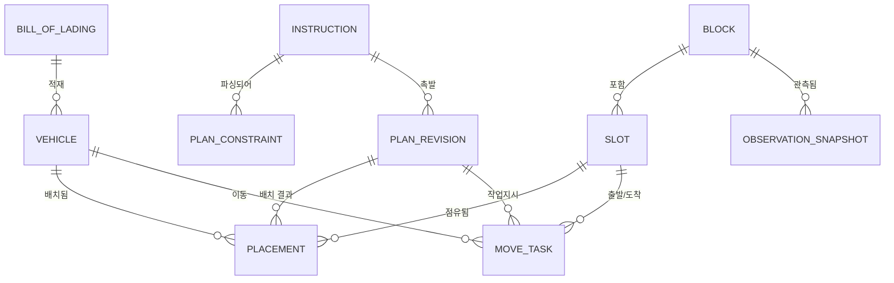

# AutoYard Copilot — 도메인 모델 (엔티티 설계)

> 근거 문서: `글로비스_청운 장표 초안.pdf`, `AI활용방안.pdf`
> 위치: `backend/src/main/java/com/Chung_Woon/Chung_Woon/domain/`

## 0. 설계 원칙 3가지

1. **승인 전에는 아무것도 반영되지 않는다.** 제약은 `PENDING_REVIEW` 로 태어나고, 계획은 `DRAFT` 로 태어난다. 상태 필드가 곧 안전장치다.
2. **덮어쓰지 않고 판(revision)으로 쌓는다.** "왜 이 차가 움직였나"에 답할 수 있어야 현장이 신뢰한다.
3. **ID 규칙을 PK로 쓴다.** `V-0001`, `B03`, `B01-R04-C07`. AI활용방안 8절의 ID 통일 규칙을 DB가 강제하게 만들고, 파이썬↔스프링 사이 ID 변환 계층을 없앤다.

## 1. 전체 관계



파이프라인상 위치:

```
자연어 지시 ──▶ Instruction ──▶ PlanConstraint (PENDING_REVIEW)
                                      │ 승인
                                      ▼
사진 ──▶ ObservationSnapshot ──▶ [최적화] ──▶ PlanRevision (DRAFT)
                                              ├─ Placement  (이 판의 전체 배치)
                                              └─ MoveTask   (현장에 나가는 작업지시)
                                      │ 승인
                                      ▼
                                  APPROVED = 현장 반영
```

## 2. 엔티티 목록

| 엔티티 | PK | 역할 | 근거 |
|---|---|---|---|
| `BillOfLading` | `bl_number` (NXR-USN-NTD-26081101) | 선하증권 1장. 차량 수십 대가 이 단위로 들어온다 | 선하증권 샘플 3장 |
| `Block` | `block_id` (B03) | 블록. 통째로 폐쇄 가능 | 장표 5쪽 BLOCK_CLOSURE |
| `Slot` | `slot_id` (B01-R04-C07) | 차 한 대 자리. 절대 좌표 + lane·depth·accessSide 보유 | AI활용방안 8절 |
| `Vehicle` | `vehicle_id` (V-0001) | 하선된 완성차 | AI활용방안 3절 |
| `Instruction` | `instruction_id` (INS-001) | 자연어 지시 **원문** | AI활용방안 2절 |
| `PlanConstraint` | `constraint_id` (C-001) | 파싱된 제약 1건 | 장표 5쪽 |
| `PlanRevision` | `id` (+`plan_version`) | 배치 계획 한 판 | 장표 4쪽 Revision Log |
| `PlanKpi` | *(embedded)* | 전후 비교 지표 | 장표 6·9쪽 |
| `Placement` | `id` | "이 판에서 이 차는 이 슬롯" | — |
| `MoveTask` | `id` | 현장 작업지시 1줄 | 장표 4쪽 Move Tasks |
| `ObservationSnapshot` | `id` | 사진 1장의 인식 결과 | AI활용방안 4절 |

## 3. 필드 상세

### 야드 격자 — 도면

팀 도면 그대로다. 코드 정본은 `domain/yard/YardGrid.java` 와 `BlockLayout.java`.

```
가로·세로 모두 4 + 22 + 4 + 22 + 4 = 56 칸

열 →   0    4              26   30              52   56
행 0  ┌────────────────────────────────────────────┐
      │            외곽 도로 (폭 4)                 │
   4  ├────┬──────────────┬────┬──────────────┬────┤
      │도로│  B01 22×22   │통로│  B02 22×22   │도로│
  26  ├────┼──────────────┼────┼──────────────┼────┤
      │            십자 통로 (폭 4)                 │
  30  ├────┼──────────────┼────┼──────────────┼────┤
      │도로│  B03 22×22   │통로│  B04 22×22   │도로│
  52  ├────┴──────────────┴────┴──────────────┴────┤
      │            외곽 도로 (폭 4)                 │
  56  └────────────────────────────────────────────┘
```

| 항목 | 값 |
|---|---|
| 격자 | 56 × 56 = 3,136칸 |
| 블록 | 4개 (B01 좌상 · B02 우상 · B03 좌하 · B04 우하), 각 22×22 |
| 주차칸 | 484 × 4 = **1,936** |
| 도로칸 | 3,136 − 1,936 = **1,200** |
| 블록 원점 | B01(4,4) B02(4,30) B03(30,4) B04(30,30) |

결정 세 가지:

- **도로는 엔티티가 아니다.** 1,200칸을 테이블에 넣어도 상태가 없다. 경로 알고리즘이 쓰는
  "지나갈 수 있는 칸" 은 `YardGrid.isRoad(row, col)` 로 판정하고, 그래프 노드는 `roadCells()` 로 받는다.
- **네 면이 모두 도로에 닿는다.** 블록 바깥 두 면은 빨간 외곽 도로, 안쪽 두 면은 파란 십자 통로다.
  그래서 한쪽에서만 들어가는 depth 는 성립하지 않는다.
- **레인은 세로 열이고, 위·아래 양쪽에서 진입한다.** 레인 22칸을 위 11 / 아래 11 로 갈라
  각각 depth 0~10 을 매긴다. 어느 쪽 도로인지는 `accessSide` 가 들고 있다.

### Block — 블록

| 필드 | 타입 | 설명 |
|---|---|---|
| `blockId` | String PK | `B03` |
| `zoneCode` | String | `EV-A` / `QC-HOLD` / `HVY-D` — 선하증권의 TARGET YARD ZONE 이 가리키는 값. **어느 블록이 어느 존인지는 아직 임시값** |
| `originRow` / `originCol` | int | 블록 왼쪽 위 칸의 야드 절대 좌표 (4 또는 30) |
| `gridSize` | int | 한 변 22 |
| `laneCount` / `depthPerLane` | int | 22 / 11 |
| `maxHeightMeters` | Double | 전고 제한. null 이면 무제한. 3.80m 트럭을 일반 블록에 넣지 않으려면 필요 |
| `closed` | boolean | 폐쇄 여부. **승인된** BLOCK_CLOSURE 만 이걸 바꾼다 |
| `closureReason` | String | 예: "도색작업" |

### Slot — 자리

| 필드 | 타입 | 설명 |
|---|---|---|
| `slotId` | String PK | `B01-R04-C07` = 블록-절대행-절대열 |
| `block` | FK | |
| `gridRow` / `gridCol` | int | 야드 절대 좌표 0~55 |
| `lane` | int | 블록 안의 세로 열 0~21 |
| `depth` | int | **진입 도로에서 몇 번째인지 0~10.** 0 이 도로에 바로 붙어 있다 |
| `accessSide` | enum | `NORTH` / `SOUTH` — 레인의 어느 쪽 도로로 들어가는지 |
| `status` | enum | `EMPTY` / `OCCUPIED` / `BLOCKED` |

> PK 에 좌표를 넣은 이유는 사진 인식 결과가 `(row, col)` 로 오기 때문이다.
> `YardGrid.slotId(row, col)` ↔ `YardGrid.cellOf(slotId)` 한 쌍으로 변환이 끝난다.
> `depth` 가 재취급 Proxy 계산의 근거다. 깊은 자리에 먼저 나갈 차를 넣으면 앞차를 빼야 한다.
> `isAssignable()` = 비어 있고 + 블록이 안 닫혔을 때만 true.
> `accessRoadCell()` 이 그 자리로 드나드는 도로 칸을 준다 — 경로 알고리즘의 출발·도착점.

블록 4개와 슬롯 1,936개는 `YardLayoutInitializer` 가 기동 시 깔아 둔다. 블록이 하나라도 있으면
건너뛰므로 운영 DB 는 최초 1회만 적재된다. 도면이 바뀌면 이 코드가 아니라 마이그레이션으로 옮겨야 한다.

### BillOfLading — 선하증권

PK 는 문서에 찍힌 번호 그대로 `NXR-USN-NTD-26081101`.

| 묶음 | 필드 |
|---|---|
| 코드 번호 | `blNumber`, `bookingNumber`, `lotCode`, `linkedRouteCode` |
| 선박·항로 | `vesselName`, `voyageNumber`, `portOfLoading`, `portOfDischarge`, `issueDate` |
| 당사자 | `shipperName`, `consigneeName`, `notifyParty` |
| 화물 요약 | `unitCount`, `grossWeightKg`, `measurementCbm` |
| **하선 데이터** | `powertrain`, `driveableCount`, `towCount`, `unloadingPriority`, `targetYardZone`, `dischargeSeqFrom/To`, `specialHandling`, `freightTerms` |

`documentType` 은 `BILL_OF_LADING` / `SEA_WAYBILL` / `STRAIGHT_BILL_OF_LADING` — 샘플 3장이 각각 다르다.

> 마지막 묶음은 문서의 **"PCTC DISCHARGE DATA"** 구획에서 온다. 그 구획에는
> *FOR HACKATHON EXTRACTION / OPTIMISATION* 이라고 적혀 있다 — 배치 최적화에 쓰라고 넣어준 값들이다.

**대수 교차 검증** — 샘플 3장 모두 아래 셋이 일치한다. 어긋나면 추출 실패로 판정한다.

| | UNITS | DRIVEABLE+TOW | SEQ 구간 |
|---|---|---|---|
| DOC 01 | 60 | 60+0 | 041~100 (60) |
| DOC 02 | 42 | 40+2 | 101~142 (42) |
| DOC 03 | 18 | 18+0 | 001~018 (18) |

### Vehicle — 차량

필드가 세 갈래에서 온다.

| 출처 | 필드 |
|---|---|
| **선하증권** | `vin`(unique), `billOfLading`, `brand`, `model`, `destination`, `dischargeSequence`, `unloadingPriority`, `powertrain`, `driveable`, `energyLevelPct`, `heightMeters` |
| **야드 운영** | `status`, `arrivedAt`, `departedAt` |
| **후속 운송** | `nextMode`, `departureCutoffAt`, `priority` |

`status` = `EXPECTED`(하선 전) → `IN_YARD`(주차중) → `DEPARTED`(출고완료).
`isPlannable()` 이 `DEPARTED` 를 걸러낸다 — 이미 나간 차를 옮기라는 작업지시가 나가면 안 되기 때문.
`dwellMinutes()` 로 체류 시간이 나온다.

> ⚠️ **우선순위가 두 종류다. 절대 한 필드로 합치지 말 것.**
> - `unloadingPriority` (P1/P2/P3) — 배에서 **내리는** 순서. 선하증권이 지정
> - `priority` (URGENT/NORMAL) — 야드에서 **나가는** 긴급도. 컷오프 기준
>
> 고데크 차량(P1)이 출고는 급하지 않을 수 있고, 그 반대도 있다.

> ⚠️ `nextMode` / `departureCutoffAt` / `priority` 는 선하증권에 **없다**.
> AI활용방안 3절이 "억지로 채우지 않고 null" 이라 했으니, 어디서 가져올지 정해야 한다
> (합성데이터 생성 / 별도 CSV / UI 입력).

> `vin` 도 문서에는 **범위**로만 있다 (`SYNT26E0000000001 TO ...060`).
> 개별 VIN 전개는 **결정론적 코드**가 한다. AI 에게 60행을 만들라고 시키면 없는 VIN 을 지어낸다.

### Instruction — 지시 원문

| 필드 | 설명 |
|---|---|
| `instructionId` PK | `INS-001` |
| `rawText` | **원문 그대로.** 파싱이 틀렸을 때 대조할 근거이자, 심사에서 보여줄 자료 |
| `author` | 지시한 사람 |
| `unresolvedJson` | 해석 못 한 표현. 비어있지 않으면 되묻기 대상 |
| `requiresConfirmation` | 되묻기 필요 여부 |
| `clarificationJson` | 되묻기 문답 이력 (재현 가능성) |

### PlanConstraint — 제약 ⭐ 핵심

| 필드 | 타입 | 설명 |
|---|---|---|
| `constraintId` PK | String | `C-001` |
| `instruction` | FK | 어느 지시에서 나왔나 |
| `type` | enum | `BLOCK_CLOSURE` / `VEHICLE_GROUPING` / `OUTBOUND_PRIORITY` |
| `priority` | enum | `HARD`(위반 시 배치 거부) / `SOFT`(페널티만) |
| `targetJson` | text | `{"block_ids":["B03"]}` |
| `valueJson` | text | `{"preferred_zone":"WEST"}` |
| `windowStart` / `windowEnd` | datetime | null = 즉시 / 해제까지 |
| `confidence` | double | 파서 신뢰도 |
| `status` | enum | `PENDING_REVIEW`(기본) / `APPROVED` / `REJECTED` |
| `reviewedBy`, `reviewedAt`, `rejectionReason` | | **반려도 이력으로 남긴다** |

> `isApplicable()` 은 `APPROVED` 일 때만 true. 최적화 엔진은 이걸 통과한 것만 받는다.
> 클래스명이 `Constraint` 가 아닌 건 `jakarta.validation.Constraint` 와 헷갈려서.

### PlanRevision — 계획 한 판

| 필드 | 설명 |
|---|---|
| `planVersion` | `B0`(baseline), `B2-r3` … unique |
| `basedOnVersion` | 어느 판에서 부분 재배치했나 |
| `triggeredBy` | 어느 지시가 촉발했나 (정기 배치면 null) |
| `status` | `DRAFT` → `PENDING_APPROVAL` → `APPROVED`/`REJECTED` |
| `kpi` | 아래 PlanKpi (embedded) |
| `approvedBy`, `approvedAt` | |
| `consistencyIssuesJson` | 코드가 대조해 넘긴 "확인 필요" 목록 |
| `briefing` | AI 브리핑 문장 |

### PlanKpi (embedded)

`avgMoveDistance` · `rehandleProxy` · `hardViolations` · `changedVehicles` · `planRetentionRate` · `calcMillis`

> **브리핑에 나오는 숫자는 전부 여기서만 나온다.** AI활용방안 5절 "AI가 수치를 생성하지 않는다"를
> 구조로 강제한 것. 브리핑은 이 필드를 문장으로 옮길 뿐이다.

### Placement / MoveTask

`Placement` = 판×차량×슬롯. DB 유니크 제약 2개를 걸어 **한 판에서 한 슬롯에 두 대, 한 차가 두 자리**를 막았다.
최적화 코드에 버그가 있어도 여기서 걸린다.

`MoveTask` = `vehicle` + `fromSlot`(신규 입고면 null) + `toSlot` + `sequence` + **`reason`(필수)** + `distanceMeters`.

> `reason` 을 필수로 둔 이유: 장표 7쪽 Minimal Replanning 의 "변경 이유 기록". 이유 없는 이동 지시는 현장이 안 따른다.
> `sequence` 는 앞차를 먼저 빼야 하는 경우가 있어서 의미를 가진다.

### ObservationSnapshot — 관측

| 필드 | 설명 |
|---|---|
| `block` | FK |
| `source` | `FIXED_CAMERA` / `DRONE` / `MANUAL`(폴백) |
| `capturedAt` | **촬영 시각** (업로드 시각 아님) |
| `gridJson` | `[{"row":0,"col":0,"occupied":true}, …]` |
| `confidence`, `requiresConfirmation` | |

> 계획과 별도 테이블인 이유: 계획(Placement)과 현실(관측)이 다를 수 있고, **그 차이를 잡는 게
> `check_consistency` 노드**다. `capturedAt` 을 업로드 시각과 구분한 건 오래된 사진으로 배치를 뒤집는 사고를 막기 위해서.

## 4. 공통

- 모든 엔티티가 `BaseTimeEntity` 상속 → `createdAt`/`updatedAt` 자동
- enum 은 전부 `@Enumerated(STRING)` (ordinal 쓰면 순서 바꿀 때 데이터 깨짐)
- JSON 페이로드는 `columnDefinition = "text"` — H2/Postgres 양쪽에서 안전하게 도는 쪽을 택함

## 4-1. 선하증권 추출 파이프라인

```
B/L 이미지 ──▶ Gemini ──▶ BillOfLadingExtraction   (문서에 적힌 그대로 = 집계값)
                              │
                              ▼ 결정론적 코드 (AI 아님)
                          Vehicle N행           (VIN range 전개, SEQ 번호 배분)
```

AI 에게 개별 차량 행을 만들라고 시키지 않는 이유 — 문서에 없는 정보라 **생성**이 되어버린다.
없는 VIN 을 지어내고, 60개를 뱉다가 잘리고, 같은 사진에서 매번 다른 결과가 나온다.
AI활용방안이 정한 "AI 는 변환·판단·되묻기만" 이라는 경계에도 어긋난다.

파이썬 쪽 스키마: `BillOfLadingExtraction`(AI 출력) → `ExpandedVehicle`(코드 출력).
`CargoLine` 이 따로 있는 이유는 DOC 03 처럼 **한 문서에 품목이 두 줄**인 경우가 있어서다
(전기버스 10대 3.25m + 대형트럭 8대 3.80m). 높이가 달라 뭉개면 안 된다.
단, DB 에 라인 테이블은 두지 않았다 — 전개 직후 차량 행이 되므로 파이썬 안에서만 잠깐 존재하면 된다.

## 4-2. 값이 바뀔 때 어디를 고치나

추출 항목과 알고리즘 입력값은 아직 확정이 아니다. 바뀔 때 고칠 곳을 미리 적어둔다.

| 무엇이 바뀌나 | 고칠 곳 | 비용 |
|---|---|---|
| 추출 필드 추가/삭제 | `ai/src/autoyard/schemas.py` → `BillOfLadingExtraction` | 낮음 |
| 그 필드를 저장해야 함 | `backend/…/billoflading/BillOfLading.java` 또는 `vehicle/Vehicle.java` | 낮음 (`ddl-auto: update` 가 컬럼을 자동 추가) |
| 알고리즘 입력값 | `docs/API_CONTRACT.md` §4 + 어댑터 | 낮음 |
| enum 값 추가 | **자바와 파이썬 양쪽** 동시에 | 중간 — 한쪽만 고치면 조용히 깨진다 |
| **ID 규칙** | `ai/src/autoyard/ids.py` + 자바 PK 컬럼 + 두 계약 문서 | **높음 — 되도록 건드리지 말 것** |

주의할 점 둘:

- 파이썬 스키마는 `extra="forbid"` 다. Gemini 가 스키마에 없는 필드를 뱉으면 **에러**가 난다.
  환각을 잡으려고 일부러 그렇게 뒀다. 프롬프트를 먼저 고치고 스키마를 안 고치면 터지는데,
  에러 메시지에 새로 온 필드명이 그대로 찍히니 그걸 보고 추가하면 된다. 이 동작은 유지할 것.
- 대수 교차 검증(§4 표)은 **필드가 아니라 숫자 관계**를 본다. 필드가 어떻게 바뀌든 그대로 쓸 수 있다.

## 5. 아직 안 정한 것 (내일 결정 필요)

0. **`ddl-auto: update` 는 컬럼을 지우지 않는다** — 필드를 옮기거나 지워도 기존 dev DB 에는
   빈 컬럼이 남는다. 깨끗이 하려면 `docker compose down -v` 후 재기동.
1. **`nextMode` / `departureCutoffAt` / `priority` 를 어디서 채우나** — 선하증권에 없음
2. ~~**좌표 ↔ 슬롯 매핑**~~ — 해결. `slot_id` 가 절대 좌표를 품는다 (`B01-R04-C07`). `YardGrid.slotId` / `YardGrid.cellOf` 한 쌍.
3. **`df_schedule.csv` 의 위치** — 파일이 50×50 격자 기준인데 확정 도면은 56×56 이다. 좌표를 어떻게 옮길지 정해야 함
4. **재취급 Proxy 계산식** — depth(0~10) 기반이라는 것만 정해짐. 한 레인이 11칸 깊이라 깊은 자리 비용이 크다
5. **블록별 `zoneCode`** — B01=EV-A / B02=GEN-B / B03=QC-HOLD / B04=HVY-D 는 지금 임시값이다. 존이 4개보다 많아지면 블록을 쪼개야 함
6. **블록별 `maxHeightMeters`** — 전부 null(무제한)이라 3.80m 전고 제약이 아직 걸리지 않는다
